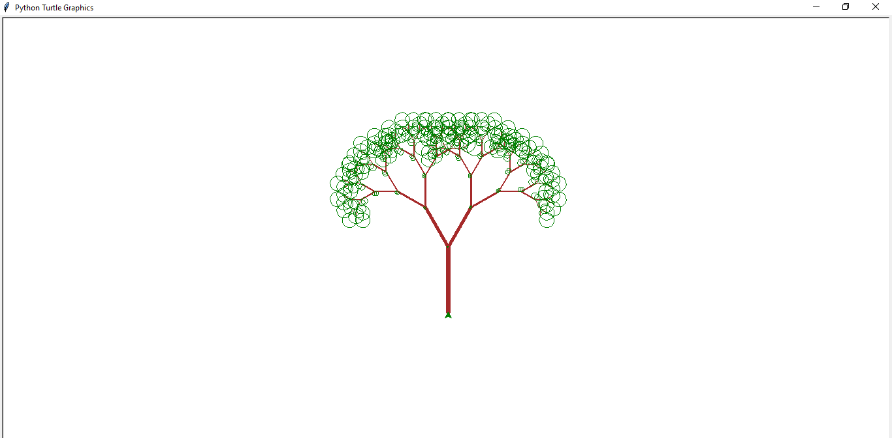

- import turtle
  tu=turtle.Turtle()
  tu.pensize(5)
  tu.color("brown")
  tu.left(90)
  tu.backward(100)
  tu.speed(0)

def tree(d):
    if d < 10:
        return
    else:
        tu.forward(d)
        tu.color("green")
        tu.circle(4)
        tu.color("brown")
        tu.pensize(3)
        tu.left(30)
        tree(d*0.7)
        tu.right(60)
        tree(d*0.7)
        tu.left(30)
        tu.backward(d)

tree(100)
turtle.done()

---