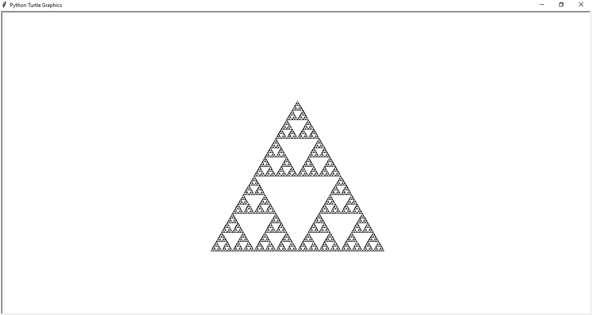

```python
import turtle

def triangle(d):
    if d < 4 :
        return
    for _ in range(3):
        triangle(d * 0.5)
        turtle.forward(d)
        turtle.left(120)

turtle.hideturtle()        
turtle.penup()
turtle.setpos(-200 , -200)
turtle.pendown()
turtle.tracer(0)
triangle(400)
turtle.update()
turtle.mainloop()
```


