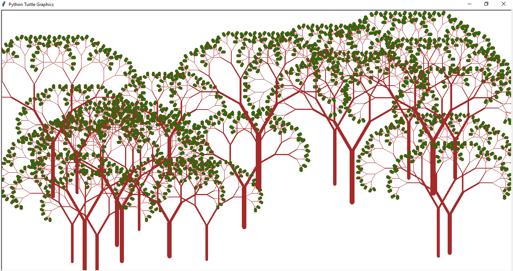

```python
import turtle
import random

def tree(d , r , s):
    if d<10:
        turtle.fillcolor("green")
        turtle.begin_fill()
        turtle.circle(d/2)
        turtle.end_fill()
        return
    
    turtle.pensize(s)
    turtle.forward(d)
    turtle.left(r)
    tree(d*0.7 , r , s*0.6)
    turtle.right(r*2)
    tree(d*0.7 , r , s*0.6)
    turtle.left(r)
    turtle.backward(d)

turtle.pencolor("brown")
turtle.left(90)
turtle.tracer(0)
turtle.penup()
turtle.right(90)
turtle.forward (20)
turtle.left(90)
turtle.pendown()

for j in range(25):
    turtle.hideturtle()
    turtle.penup()
    turtle.setpos(random.randint(-570,570) , random.randint(-350,-80))
    turtle.pendown()
    tree(random.randint(80,150) , 30 , random.randint(7,15))
    turtle.penup()
    turtle.setpos(0,-150)
    turtle.pendown()
    
turtle.update()
turtle.mainloop()
```


