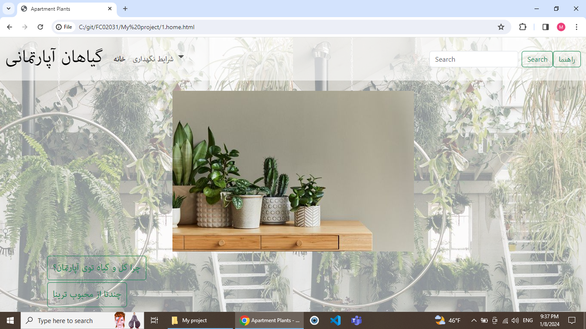

بخش زیادی از پروژه‌ی من متمرکز بر فرانت‌اند هست که با کمک کد های *بوت‌استرپ درستش کردم
برای دیپلوی کردن سایتم به دو مشکل برخوردم،مشکل اول لینک نبودن صفحات اچ‌تی‌ام‌ال به هم و مشکل دوم اپلود نشدن فایل های استتیک
لینک نبودن صفحات که همون ورز درست شد اما مشکل عکس ها همچنان وجود داره

بزرگترین ایراد این وبسایت نداشتن بک اندهست . مثلا بهتر بود یک قسمت برای کامنت ارائه می‌شد تا وبسایت 
هم از نظر بک‌اند و هم از نظر فرانت‌اند کامل باشه

* [Bootstrap](https://getbootstrap.com/)

---

